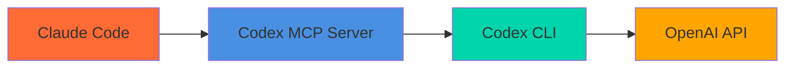

# Codex MCP Server

[](https://www.npmjs.com/package/codex-mcp-server)
[](https://www.npmjs.com/package/codex-mcp-server)
[](https://www.npmjs.com/package/codex-mcp-server)

Bridge between Claude and OpenAI's Codex CLI — get AI-powered code analysis, generation, and review right in your editor.



## Quick Start

### 1. Install Codex CLI

```bash
npm i -g @openai/codex
codex login --api-key "your-openai-api-key"
```

### 2. Add to Claude Code

```bash
claude mcp add codex-cli -- npx -y codex-mcp-server
```

### 3. Start Using

```
Ask codex to explain this function
Use codex to refactor this code for better performance
Use review to check my uncommitted changes
```

## One-Click Install

[](https://vscode.dev/redirect/mcp/install?name=codex-cli&config=%7B%22type%22%3A%22stdio%22%2C%22command%22%3A%22npx%22%2C%22args%22%3A%5B%22-y%22%2C%22codex-mcp-server%22%5D%7D)
[](https://insiders.vscode.dev/redirect/mcp/install?name=codex-cli&config=%7B%22type%22%3A%22stdio%22%2C%22command%22%3A%22npx%22%2C%22args%22%3A%5B%22-y%22%2C%22codex-mcp-server%22%5D%7D)
[](https://cursor.com/en/install-mcp?name=codex&config=eyJ0eXBlIjoic3RkaW8iLCJjb21tYW5kIjoibnB4IC15IGNvZGV4LW1jcC1zZXJ2ZXIiLCJlbnYiOnt9fQ%3D%3D)

## Tools

| Tool | Description |
|------|-------------|
| `codex` | AI coding assistant with session support, model selection, and structured output metadata |
| `review` | AI-powered code review for uncommitted changes, branches, or commits |
| `websearch` | Web search using Codex CLI with customizable result count and search depth |
| `listSessions` | View active conversation sessions |
| `ping` | Test server connection |
| `help` | Get Codex CLI help |

## Examples

**Code analysis:**
```
Use codex to analyze this authentication logic for security issues
```

**Multi-turn conversations:**
```
Use codex with sessionId "refactor" to analyze this module
Use codex with sessionId "refactor" to implement your suggestions
```
Passing a sessionId creates the session on first use, so listSessions will show
it (for this server instance) and subsequent calls can resume context.

**Code review:**
```
Use review with base "main" to check my PR changes
Use review with uncommitted true to review my local changes
```

**Advanced options:**
```
Use codex with model "o3" and reasoningEffort "high" for complex analysis
Use codex with fullAuto true and sandbox "workspace-write" for automated tasks
Use codex with callbackUri "http://localhost:1234/callback" for static callbacks
Use codex to return structuredContent with threadId metadata when available
```

**Web search:**
```
Use websearch with query "TypeScript 5.8 new features"
Use websearch with query "Rust vs Go performance 2025" and numResults 15
Use websearch with query "React Server Components" and searchDepth "full"
```

## Requirements

- **Codex CLI v0.75.0+** — Install with `npm i -g @openai/codex` or `brew install codex`
- **OpenAI API key** — Run `codex login --api-key "your-key"` to authenticate

## Codex 0.87 Compatibility
- **Thread ID + structured output**: When Codex CLI emits `threadId`, this server returns it in content metadata and `structuredContent`, and advertises an `outputSchema` for structured responses.

## Linux Setup Notes (Ubuntu 24.04+)

Verified on Ubuntu 24.04.3 LTS. None of this is fork-specific code — it's environment
setup, so it applies whether you're running this server as-is or from a clone.

### `spawn codex ENOENT`
The MCP server process needs `codex` on *its own* PATH, which does not inherit your
shell's `~/.bashrc`. This bites people who installed `@openai/codex` to a non-default
npm prefix (see next section) — the server was registered before the codex binary's
directory was on PATH. Fix by passing PATH explicitly when registering the server:
```bash
claude mcp add codex --scope user \
  -e PATH="$HOME/.npm-global/bin:/usr/local/sbin:/usr/local/bin:/usr/sbin:/usr/bin:/sbin:/bin" \
  -- node /path/to/codex-mcp-server/dist/index.js
```

### `npm install -g @openai/codex` fails with `EACCES`
Distro-packaged Node often ships a global prefix (`/usr/lib/node_modules`) the login
user can't write to. Don't `sudo npm install -g` — switch to a user-owned prefix:
```bash
mkdir -p ~/.npm-global
npm config set prefix ~/.npm-global
export PATH="$HOME/.npm-global/bin:$PATH"   # add this line to ~/.bashrc too
npm install -g @openai/codex
```

### `codex review` fails: `bwrap: loopback: Failed RTM_NEWADDR: Operation not permitted`
Ubuntu 24.04+ ships `kernel.apparmor_restrict_unprivileged_userns=1` by default — set by
the `apparmor` package itself (`/usr/lib/sysctl.d/10-apparmor.conf`), not a local
hardening choice, so this hits any stock Ubuntu 24.04+ box. `codex review` hardcodes
`sandbox=read-only` and ignores `-c sandbox_*` config overrides (verified empirically —
there is no config-level fix), and its sandbox shells out to the *system* `/usr/bin/bwrap`
to build an isolated namespace. That AppArmor policy denies the `net_admin`/`setpcap`
capabilities bwrap needs to bring up the sandbox's loopback interface.

Worse: Codex doesn't error when this happens — it silently falls back to a "no findings,
low confidence" response, which looks identical to a real clean review. (This server's
`review` tool detects the `sandbox failed` phrase in the response and raises it as a
tool failure instead — see below — but the sandbox itself still needs fixing to get a
review that actually reads your diff.)

Fix with a scoped AppArmor local profile (grants the capability to `bwrap` only, leaves
`apparmor_restrict_unprivileged_userns` enforced for everything else):
```
# /etc/apparmor.d/codex-bwrap
abi <abi/4.0>,
include <tunables/global>

profile codex-bwrap /usr/bin/bwrap flags=(unconfined) {
  userns,

  include if exists <local/codex-bwrap>
}
```
```bash
sudo apparmor_parser -r /etc/apparmor.d/codex-bwrap
```
Persists across reboots (`apparmor.service` loads everything under `/etc/apparmor.d/`
at boot). This targets the *system* `bwrap`, not a Codex-private copy — Codex resolves
`bwrap` via PATH and prefers the system binary when present, so a narrower per-binary
profile isn't achievable without also removing system `bwrap` from PATH.

### Silent sandbox-failure detection (not Linux-specific)
`review` checks the CLI response text for `sandbox failed` and raises it as a tool
failure instead of returning it as a completed review. A sandbox that can't initialize
otherwise looks identical to a genuinely clean review — this matters on any platform
where Codex's sandbox can fail to init (Windows has its own, different sandbox quirks),
not just this Linux case.

## Documentation

- **[API Reference](docs/api-reference.md)** — Full tool parameters and response formats
- **[Session Management](docs/session-management.md)** — How conversations work
- **[Codex CLI Integration](docs/codex-cli-integration.md)** — Version compatibility and CLI details

## Environment Variables
- `CODEX_MCP_CALLBACK_URI`: Static MCP callback URI passed to Codex when set (overridden by `callbackUri` tool arg)

## Development

```bash
npm install    # Install dependencies
npm run dev    # Development mode
npm run build  # Build for production
npm test       # Run tests
```

## Related Projects

- **[gemini-mcp-server](https://github.com/tuannvm/gemini-mcp-server)** — MCP server for Gemini CLI with 1M+ token context, web search, and media analysis
- **[Clotch](https://github.com/tuannvm/clotch)** — Dynamic Island for Claude Code on macOS — monitor sessions across multiple machines and providers in real time

## License

ISC
